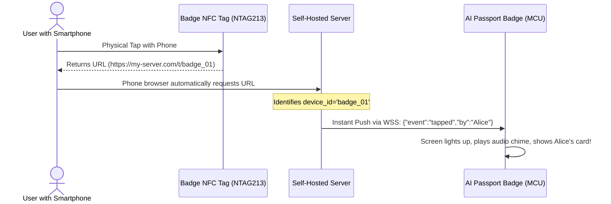

<p align="right">
  <strong>English</strong> · <a href="architecture.zh_CN.md">简体中文</a>
</p>

# Cloud-Edge Thin-Client Architecture & Server-Side BFF Specification

> **Scope & Target**: This document specifies the hardware-software communication standards for the FoloToy AI Passport (ESP32-C3) operating as a **Server-Augmented Thin Client** paired with a self-hosted server or cloud BFF. Use this architecture for network voice intercom, AI flashcards, audio/video streaming, LLM dialogs, and low-code integrations.
>
> *(Note: Hardware pin definitions, bus ownership, and electrical specifications strictly follow: `components/bsp/include/bsp_pins.h` and `docs/hardware-design/AI_HARDWARE_DEVELOPMENT_GUIDE.md`.)*

---

## 1. Core Architecture Paradigm: Physical Client + Cloud Brain (BFF)

The system adopts a decoupled client-server hierarchy: the ESP32-C3 acts as a lightweight physical interface handling sensor inputs, screen rendering, and audio I/O; the external server or PC handles heavy compute, LLM orchestration, and business state:

```text
┌──────────────────────────────────────────────┐
│     FoloToy AI Passport (Physical Persona)   │
│                                              │
│  • Input:  PTT 16kHz PCM audio stream        │
│  • Visual: 240×320 Focus-cursor UI & 30fps   │
│            1-bit Pip-Boy retro animations    │
│  • Output: Streaming MP3 playback            │
│  • Anchor: Passive NFC tag for smartphone tap│
└──────────────────────┬───────────────────────┘
                       │
          Single Full-Duplex WSS Tunnel
          (Multiplexed binary + JSON)
                       │
┌──────────────────────▼───────────────────────┐
│       Self-Hosted Server / PC (Super-Brain)  │
│                                              │
│  • BFF Gateway: Normalizes APIs (< 512B JSON)│
│  • Speech: Local Whisper STT + Streaming TTS │
│  • Intelligence: Claude / GPT-4o / Ollama    │
│  • Automation: IDE, Git Hooks, HomeAssistant │
│  • Transcoder: Converts video to 1-bit RLE   │
└──────────────────────────────────────────────┘
```

---

## 2. Storage & Memory Allocation: The Three-Tier Model

To guarantee zero heap fragmentation and zero Out-of-Memory (OOM) crashes on the ESP32-C3 (which has **no PSRAM** and only ~100 KB free heap):

```text
  ┌─────────────────────────────────────────────────────────────────────────────┐
  │ 1. Device RAM (~100 KB Free Heap) ──► Transient Sliding Viewport            │
  │    • PTT Mic Capture: 2 KB double-buffer (1024 bytes × 2)                   │
  │    • TTS Audio Ring Buffer: 16 KB (for chunked MP3 streaming)               │
  │    • Screen Text Label Buffer: < 1 KB (holds only the ~200 visible chars)   │
  │    • Frame Buffers: 9.6 KB (LVGL single 20-row DMA buffer)                  │
  ├─────────────────────────────────────────────────────────────────────────────┤
  │ 2. Device Flash (8 MB NOR Flash) ──► Local Arsenal & Offline Cache          │
  │    • Embedded fonts (Montserrat + 837 KB CJK binary font partition in Flash)│
  │    • Fixed audio assets (click, error buzzer, chime, power tone)            │
  │    • Offline reading cache (appends long-text dialogs via LittleFS)         │
  │    • Palette Look-Up Tables (LUT presets for Pip-Boy, Amber, Matrix)        │
  ├─────────────────────────────────────────────────────────────────────────────┤
  │ 3. Server Storage (Infinite)     ──► Master Source of Truth                 │
  │    • High-fidelity raw audio logs (FLAC/WAV)                                │
  │    • Complete multi-turn conversation logs and RAG vector databases         │
  │    • Heavy business logic, external API integrations, and secret keys       │
  └─────────────────────────────────────────────────────────────────────────────┘
```

> **Critical Rule**: Never write live 32 KB/s audio recording streams to NOR Flash. Flash sector erasure (4 KB) stalls the SPI bus, causing audio crackles and degrading flash wear. Live voice must stream directly: `I2S DMA (RAM 2 KB) ──► TCP Socket`.

---

## 3. Mandatory Full-Duplex WebSocket Invariant (vs. The REST Fallacy)

In embedded IoT architectures, an intuitive assumption is often: *"Wouldn't stateless REST APIs be more memory-efficient since connections can be closed immediately after each turn?"* **On the ESP32-C3 (no PSRAM, ~100 KB free heap), using REST for interactive voice and AI streaming is disastrous for both stability and latency**:

### 3.1 Why REST APIs Fail for Interactive Voice AI
1. **Audio Cannot Be Buffered in RAM (No-PSRAM Constraint)**:
   - A 16kHz 16-bit mono PCM recording produces 32 KB/s; a brief 5-second query amounts to **160 KB**.
   - The ESP32-C3 only has ~100 KB of usable heap. It is physically impossible to hold the full recording in RAM to perform a standard HTTP POST request.
   - NOR Flash cannot be used as an audio buffer (erasing 4KB sectors stalls the SPI bus for tens of milliseconds, causing audio distortion and burning flash endurance). Live voice must stream directly: `I2S DMA (2 KB ping-pong buffer) ──► TCP Socket`.
2. **TLS Handshake RAM Spikes and Heap Fragmentation**:
   - Each HTTPS REST handshake dynamically requires **30 to 35 KB of contiguous heap** for asymmetric key exchange and certificate parsing.
   - Constantly opening and closing HTTPS connections in a ~100 KB heap causes rapid fragmentation and unpredictable `out of memory` aborts.
   - **WebSocket handshakes only once** upon connection; in the steady streaming state, it consumes only **~12 to 16 KB** of steady RAM.
3. **Half-Duplex Queuing & Inability to Barge-In**:
   - REST is strictly request-response. It cannot deliver real-time UI card state changes concurrently while streaming TTS audio, nor can it handle mid-utterance user interruptions (barge-in).

### 3.2 The Standard: Multiplexed Full-Duplex WSS Connection

All hot-path traffic is multiplexed through a single persistent WSS (TLS WebSocket) connection:

```text
  Client ───────[ Binary Frame: 0x01 + 1024B PCM Chunk ]────────► Server (Live Voice Stream, 2KB ping-pong)
  Client ───────[ Text Frame: {"action":"press","btn":"ok"} ]───► Server (Button / Interruption / Paging)
  Server ◄──────[ Text Frame: {"type":"card_word", ...} ]─────── Client (Structured Card Layout JSON)
  Server ◄──────[ Text Frame: {"delta":"Hello, world"} ]──────── Client (Live LLM Typewriter Tokens)
  Server ◄──────[ Binary Frame: 0x02 + MP3 Audio Slice ]──────── Client (TTS Streaming Playback)
  Server ◄──────[ Binary Frame: 0x03 + 1-bit Bitmap Slice ]───── Client (Rare Glyphs / Stroke Order / Retro Art)
```

### 3.3 Connection Lifecycle & Low-Power Sleep Strategy
Maintaining a persistent connection does not require leaving Wi-Fi TX/RX on indefinitely:
* **Active Session**: Keep the WSS connection open with lightweight keep-alive pings (every 30s) or event-driven traffic, achieving 0ms connection latency for back-and-forth turns.
* **Idle Timeout Disconnect**: If no user interaction occurs for **30 to 60 seconds**, the client gracefully closes the WSS connection and transitions the Wi-Fi modem into **Modem-Sleep or Light-Sleep** (< 5 mA), dramatically extending battery life.
* **Instant Reconnection**: When the user presses a button, Wi-Fi wakes up instantly, resuming the WSS connection within 100–200ms via TLS Session Resumption (Session Tickets).

---

## 4. The Virtual Viewport Pattern (Infinite Long-Text Pagination)

When the server's LLM outputs a 10,000-word response:

1. **Live Generation**: The server streams tokens via WebSocket. The screen renders a real-time typewriter effect for the first ~200 characters. Simultaneously, the device appends incoming text to a local LittleFS file (`/spiffs/chat_last.txt`).
2. **Scrolling / Paging**:
   - **Local Mode (0ms latency)**: Pressing `DOWN` reads the next 14 lines from the local Flash file and swaps the LVGL label content.
   - **Cloud Mode (Server Cursor)**: If Flash caching is bypassed, pressing `DOWN` sends `{"req":"page","offset":1}`. The server responds with `< 500 bytes` containing the next 200 characters.
3. **RAM Invariant**: The LVGL Label memory consumption remains **constant (< 1 KB)**, regardless of whether the document is 1 page or 1,000 pages.

---

## 5. Server-Transcoded Palette Animation Engine (Pip-Boy & Retro CRT)

While the ESP32-C3 cannot decode H.264 video, it can easily display **25–30 fps full-screen retro animations** using server-side rasterization and client-side Look-Up Tables (LUT).

### Pipeline Architecture
```text
  [Server: Video / GIF Source]
         │
         ▼ (FFmpeg resize to 240×320 + Threshold Binarization + RLE compression)
  [2 ~ 3 KB RLE Frame Payload]
         │
         ▼ (WebSocket Stream)
  [AI Passport: Expand via LUT to RGB565 Line Buffer]
         │
         ├── Bit 0 ──► Background Color: CRT Phosphor Dark (#061006)
         └── Bit 1 ──► Foreground Color: Pip-Boy High-Glow Green (#20FF20)
         │
         ▼ (Optional Scanline Filter: reduce brightness on odd lines)
  [ST7789P3 Display]: Crisp, 30fps Pip-Boy / Matrix retro animation!
```

### Retro Color Palette Presets
```c
// Example LUT definitions on the device
static const uint16_t PALETTE_FALLOUT[2]  = { 0x0841, 0x27E4 }; // #061006 (Dark Olive), #20FF20 (Rad-Green)
static const uint16_t PALETTE_AMBER[2]    = { 0x1040, 0xFD60 }; // #100800 (Dark Charcoal), #FFB000 (Amber)
static const uint16_t PALETTE_MATRIX[2]   = { 0x0100, 0x07E6 }; // #020A02 (Deep Obsidian), #00FF66 (Emerald)
```

---

## 6. Dynamic Cloud Relay for Passive NFC (NTAG213)

The AI Passport has a **passive NTAG213 tag** with no physical connection to the MCU. To make the badge react when someone taps it:



---

## 7. Wire Protocol & Interface Standards (API & Transmission Contract)

Regardless of the server language or framework used, communication with the ESP32-C3 client must strictly adhere to the following lightweight, low-memory transmission contracts.

### 7.1 Auxiliary REST API Contract (Strictly for Cold-Path Operations)

> [!WARNING]
> **Boundary Warning**: REST APIs are strictly permitted for one-time initialization, Wi-Fi provisioning checks, or low-frequency telemetry. **PROHIBITED** for voice streaming, real-time query turns, live LLM token streaming, long-text paging, or card state synchronization.

#### 1. HUD Telemetry Endpoint (BFF Data Slimming)
* **Request**: `GET /api/v1/hud?badge_id={id}`
* **Constraint**: ESP32-C3 has no PSRAM; response body must remain `< 512 bytes`.
* **Payload Schema**:
  ```json
  {
    "title": "Current Core Status",
    "sub": "Subtitle / Task Progress",
    "status_code": 1,
    "color": "rad_green",
    "options": ["Action A", "Action B"]
  }
  ```

#### 2. Passive NFC Tap Webhook Endpoint
* **Request**: `GET /t/{badge_id}`
* **Trigger**: A smartphone taps the passive NTAG213 tag and opens this URL.
* **Behavior**: The server asynchronously dispatches an alert event to the badge's WebSocket connection and returns a web page to the mobile browser.

---

### 7.2 Core WebSocket Full-Duplex Multiplexing Contract (`/ws/badge/{badge_id}`)

All high-frequency, bidirectional streaming traffic is multiplexed over this single WSS connection. The board features three physical buttons (`UP`, `DOWN`, `OK`) sharing a single resistor ladder on GPIO0 (ADC1_CH0). PTT voice streaming is typically mapped to **holding the `OK` button**, while `UP`/`DOWN` buttons drive viewport pagination and scrolling.

Data streams are strictly separated by frame types:

#### 1. Upstream Data (Client ──► Server)
| Frame Type | Content & Format | Specification & Semantics |
| :--- | :--- | :--- |
| **Binary Frame** | Microphone voice capture stream | 16 kHz, 16-bit, mono raw PCM. When `OK` is held, flush 1024 bytes (32ms) per packet. |
| **Text Frame (Button Event)** | Physical button events | JSON format: `{"type":"btn","key":"ok","gesture":"short"}` |
| **Text Frame (PTT Control)** | PTT voice stream start/end markers | Press OK: `{"type":"ptt_start"}`; release OK: `{"type":"ptt_end"}` |
| **Text Frame (Paging Req)** | Viewport paging request | Triggered by UP/DOWN: `{"type":"page_req","doc_id":"conv_9821","offset":2}` |

#### 2. Downstream Data (Server ──► Client)
| Frame Type | Content & Format | Client Processing Action |
| :--- | :--- | :--- |
| **Text Frame (Text Stream)** | Live typewriter token delta:<br>`{"type":"delta","text":"char"}` | Appends to the screen's LVGL label buffer. Constant memory. |
| **Text Frame (Viewport Page)** | Viewport page response slice:<br>`{"type":"page_resp","doc_id":"conv_9821","offset":2,"total":12,"text":"..."}` | Swaps visible label text. Constant < 1 KB memory, zero TLS re-handshake overhead. |
| **Text Frame (Card Model)** | Structured educational/status flashcard:<br>`{"type":"card_word", "word":"apple", ...}`<br>`{"type":"card_char", "char":"\\u821E", "pinyin":"wu", ...}` | Parses and renders to LVGL card widget layout for instant learning feedback. |
| **Binary Frame (Audio Stream)** | MP3 audio stream slices (`0x02` header) | Written into the 16KB ring buffer; pre-buffers 4KB before Helix software decode & I2S playback. |
| **Binary Frame (Glyph/Bitmap Stream)** | 1-bit / 2-bit RLE bitmap frame (`0x03` header) | Renders uncached Chinese characters, stroke orders, or retro animation directly to SPI display RAM. |
| **Text Frame (Control Command)** | Force alert / screen override:<br>`{"type":"alert","level":"critical","msg":"text"}` | Triggers audio beep and displays emergency red HUD. |

---

### 7.3 Recommended Transmission Parameters

| Stream Direction | Channel | Format & Encoding | Chunk / Buffer Budget | Performance Target |
| :--- | :--- | :--- | :--- | :--- |
| **Mic Voice Upstream** | WSS Binary Frame | 16 kHz 16-bit Mono PCM | 1024 bytes / packet (32ms) | Constant 2KB RAM double-buffer; server VAD |
| **Speaker Audio Downstream** | WSS Binary Frame | 32–64kbps CBR/VBR MP3 | Slices (512–2048 bytes) | 16KB ring buffer with 4KB jitter buffer |
| **Typewriter / Card Downstream**| WSS Text Frame | UTF-8 JSON delta / card model | Tens of bytes to hundreds of bytes | Time-To-First-Token (TTFT) < 300ms |
| **Bitmap / Animation Downstream**| WSS Binary Frame | 1-bit / 2-bit RLE bitmap | 512 bytes ~ 3 KB / frame | Instant rare glyph render; 25–30 fps smooth video |
