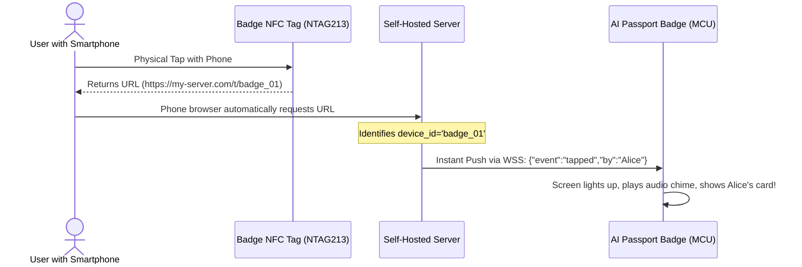

<p align="right">
  <strong>English</strong> · <a href="architecture.zh_CN.md">简体中文</a>
</p>

# Cloud-Edge Architecture & Server-Side BFF Blueprint

> **The Missing Half of AI Passport**: Official repository documentation focuses on standalone firmware, minimal test menus, and isolated offline demos. This document defines the **server-augmented thin-client architecture**—leveraging a self-hosted server or personal computer to transcend hardware boundaries without violating ESP32-C3 memory limits.
>
> *(For board-level hardware facts, pin mappings, and electrical specs, refer directly to official sources: `components/bsp/include/bsp_pins.h` and `docs/hardware-design/AI_HARDWARE_DEVELOPMENT_GUIDE.md`.)*

---

## 1. The Core Paradigm: Physical Persona + Cloud Super-Brain

The official repository treats the AI Passport primarily as a standalone MCU device. With a dedicated server, we invert the system hierarchy:

```text
┌──────────────────────────────────────────────┐
│     FoloToy AI Passport (Physical Persona)   │
│                                              │
│  • Input:  PTT 16kHz PCM audio stream        │
│  • Visual: 240×320 Focus-cursor UI & 30fps   │
│            1-bit Pip-Boy retro animations    │
│  • Output: Streaming MP3 playback            │
│  • Anchor: Passive NFC tag for smartphone tap│
└──────────────────────┬───────────────────────┘
                       │
          Single Full-Duplex WSS Tunnel
          (Multiplexed binary + JSON)
                       │
┌──────────────────────▼───────────────────────┐
│       Self-Hosted Server / PC (Super-Brain)  │
│                                              │
│  • BFF Gateway: Normalizes APIs (< 512B JSON)│
│  • Speech: Local Whisper STT + Streaming TTS │
│  • Intelligence: Claude / GPT-4o / Ollama    │
│  • Automation: IDE, Git Hooks, HomeAssistant │
│  • Transcoder: Converts video to 1-bit RLE   │
└──────────────────────────────────────────────┘
```

---

## 2. Storage & Memory Allocation: The Three-Tier Model

To guarantee zero heap fragmentation and zero Out-of-Memory (OOM) crashes on the ESP32-C3 (which has **no PSRAM** and only ~100 KB free heap):

```text
  ┌─────────────────────────────────────────────────────────────────────────────┐
  │ 1. Device RAM (~100 KB Free Heap) ──► Transient Sliding Viewport            │
  │    • PTT Mic Capture: 2 KB double-buffer (1024 bytes × 2)                   │
  │    • TTS Audio Ring Buffer: 16 KB (for chunked MP3 streaming)               │
  │    • Screen Text Label Buffer: < 1 KB (holds only the ~200 visible chars)   │
  │    • Frame Buffers: 9.6 KB (LVGL single 20-row DMA buffer)                  │
  ├─────────────────────────────────────────────────────────────────────────────┤
  │ 2. Device Flash (8 MB NOR Flash) ──► Local Arsenal & Offline Cache          │
  │    • Embedded fonts (Montserrat + compact Chinese glyph tables)             │
  │    • Fixed audio assets (click, error buzzer, chime, power tone)            │
  │    • Offline reading cache (appends long-text dialogs via LittleFS)         │
  │    • Palette Look-Up Tables (LUT presets for Pip-Boy, Amber, Matrix)        │
  ├─────────────────────────────────────────────────────────────────────────────┤
  │ 3. Server Storage (Infinite)     ──► Master Source of Truth                 │
  │    • High-fidelity raw audio logs (FLAC/WAV)                                │
  │    • Complete multi-turn conversation logs and RAG vector databases         │
  │    • Heavy business logic, external API integrations, and secret keys       │
  └─────────────────────────────────────────────────────────────────────────────┘
```

> **Critical Rule**: Never write live 32 KB/s audio recording streams to NOR Flash. Flash sector erasure (4 KB) stalls the SPI bus, causing audio crackles and degrading flash wear. Live voice must stream directly: `I2S DMA (RAM 2 KB) ──► TCP Socket`.

---

## 3. The Unified Full-Duplex WebSocket Protocol

Opening separate HTTPS connections for recording upload, text polling, and audio download consumes **~35 KB of RAM per TLS handshake**—two concurrent TLS connections will exhaust the heap.

**The Solution**: Establish **a single persistent WSS (TLS WebSocket) connection** and multiplex all traffic:

```text
  Client ───────[ Binary Frame: 0x01 + 1024B PCM Chunk ]────────► Server (Audio Stream)
  Client ───────[ Text Frame: {"action":"press","btn":"ok"} ]───► Server (Input Event)
  Server ◄──────[ Text Frame: {"delta":"Hello, world"} ]──────── Client (Live LLM Token)
  Server ◄──────[ Binary Frame: 0x02 + MP3 Audio Slice ]──────── Client (TTS Playback)
  Server ◄──────[ Text Frame: {"cmd":"set_card", ...} ]───────── Client (State Sync)
```

---

## 4. The Virtual Viewport Pattern (Infinite Long-Text Pagination)

When the server's LLM outputs a 10,000-word response:

1. **Live Generation**: The server streams tokens via WebSocket. The screen renders a real-time typewriter effect for the first ~200 characters. Simultaneously, the device appends incoming text to a local LittleFS file (`/spiffs/chat_last.txt`).
2. **Scrolling / Paging**:
   - **Local Mode (0ms latency)**: Pressing `DOWN` reads the next 14 lines from the local Flash file and swaps the LVGL label content.
   - **Cloud Mode (Server Cursor)**: If Flash caching is bypassed, pressing `DOWN` sends `{"req":"page","offset":1}`. The server responds with `< 500 bytes` containing the next 200 characters.
3. **RAM Invariant**: The LVGL Label memory consumption remains **constant (< 1 KB)**, regardless of whether the document is 1 page or 1,000 pages.

---

## 5. Server-Transcoded Palette Animation Engine (Pip-Boy & Retro CRT)

While the ESP32-C3 cannot decode H.264 video, it can easily display **25–30 fps full-screen retro animations** using server-side rasterization and client-side Look-Up Tables (LUT).

### Pipeline Architecture
```text
  [Server: Video / GIF Source]
         │
         ▼ (FFmpeg resize to 240×320 + Threshold Binarization + RLE compression)
  [2 ~ 3 KB RLE Frame Payload]
         │
         ▼ (WebSocket Stream)
  [AI Passport: Expand via LUT to RGB565 Line Buffer]
         │
         ├── Bit 0 ──► Background Color: CRT Phosphor Dark (#061006)
         └── Bit 1 ──► Foreground Color: Pip-Boy High-Glow Green (#20FF20)
         │
         ▼ (Optional Scanline Filter: reduce brightness on odd lines)
  [ST7789P3 Display]: Crisp, 30fps Pip-Boy / Matrix retro animation!
```

### Retro Color Palette Presets
```c
// Example LUT definitions on the device
static const uint16_t PALETTE_FALLOUT[2]  = { 0x0841, 0x27E4 }; // #061006 (Dark Olive), #20FF20 (Rad-Green)
static const uint16_t PALETTE_AMBER[2]    = { 0x1040, 0xFD60 }; // #100800 (Dark Charcoal), #FFB000 (Amber)
static const uint16_t PALETTE_MATRIX[2]   = { 0x0100, 0x07E6 }; // #020A02 (Deep Obsidian), #00FF66 (Emerald)
```

---

## 6. Dynamic Cloud Relay for Passive NFC (NTAG213)

The AI Passport has a **passive NTAG213 tag** with no physical connection to the MCU. To make the badge react when someone taps it:



---

## 7. Wire Protocol & Interface Standards (API & Transmission Contract)

Regardless of the server language or framework used, communication with the ESP32-C3 client must strictly adhere to the following lightweight, low-memory transmission contracts.

### 7.1 Core REST API Contract (Stateless Telemetry & Actions)

#### 1. HUD Telemetry Endpoint (BFF Data Slimming)
* **Request**: `GET /api/v1/hud?badge_id={id}`
* **Constraint**: ESP32-C3 has no PSRAM; response body must remain `< 512 bytes`.
* **Payload Schema**:
  ```json
  {
    "title": "Current Core Status",
    "sub": "Subtitle / Task Progress",
    "status_code": 1,
    "color": "rad_green",
    "options": ["Action A", "Action B"]
  }
  ```

#### 2. Virtual Viewport Pagination Endpoint (Infinite Text Slicing)
* **Request**: `GET /api/v1/text/page?badge_id={id}&doc_id={id}&offset={n}&limit=200`
* **Constraint**: The 240×320 screen holds ~150–200 characters per viewport; fetch only one viewport at a time.
* **Payload Schema**:
  ```json
  {
    "doc_id": "conv_9821",
    "offset": 2,
    "total_pages": 12,
    "has_next": true,
    "text": "The next 200 characters of text content to render in the current viewport..."
  }
  ```

#### 3. Passive NFC Tap Webhook Endpoint
* **Request**: `GET /t/{badge_id}`
* **Trigger**: A smartphone taps the passive NTAG213 tag and opens this URL.
* **Behavior**: The server asynchronously dispatches an alert event to the badge's WebSocket connection and returns a web page to the mobile browser.

---

### 7.2 WebSocket Full-Duplex Multiplexing Contract (`/ws/badge/{badge_id}`)

All high-frequency, bidirectional streaming traffic is multiplexed over this single WSS connection, separated by frame types:

#### 1. Upstream Data (Client ──► Server)
| Frame Type | Content & Format | Specification & Timing |
| :--- | :--- | :--- |
| **Binary Frame** | Microphone voice capture stream | 16 kHz, 16-bit, mono raw PCM. Flush 1024 bytes (32ms) per packet. |
| **Text Frame** | Physical button events & telemetry | JSON format: `{"type":"btn","key":"ok","gesture":"short"}` |

#### 2. Downstream Data (Server ──► Client)
| Frame Type | Content & Format | Client Processing Action |
| :--- | :--- | :--- |
| **Text Frame (Text Stream)** | Live typewriter token delta:<br>`{"type":"delta","text":"char"}` | Appends to the screen's LVGL label buffer. Constant memory. |
| **Binary Frame (Audio Stream)** | MP3 audio stream slices (optional `0x02` header) | Written into the 16KB ring buffer; pre-buffers 4KB before I2S start. |
| **Binary Frame (Animation Stream)** | 1-bit / 2-bit RLE bitmap frame (`0x03` header) | Decoded via Palette Look-Up Table (LUT) directly to SPI DMA at 25–30 fps. |
| **Text Frame (Control Command)** | Force alert / screen override:<br>`{"type":"alert","level":"critical","msg":"text"}` | Triggers audio beep and displays emergency red HUD. |

---

### 7.3 Recommended Transmission Parameters

| Stream Direction | Channel | Format & Encoding | Chunk / Buffer Budget | Performance Target |
| :--- | :--- | :--- | :--- | :--- |
| **Mic Voice Upstream** | WSS Binary Frame | 16 kHz 16-bit Mono PCM | 1024 bytes / packet (32ms) | Constant 2KB RAM double-buffer; server VAD |
| **Speaker Audio Downstream** | WSS Binary Frame | 32–64kbps CBR/VBR MP3 | Slices (512–2048 bytes) | 16KB ring buffer with 4KB jitter buffer |
| **Typewriter Text Downstream** | WSS Text Frame | UTF-8 JSON token delta | Few bytes to tens of bytes | Time-To-First-Token (TTFT) < 300ms |
| **Retro Animation Downstream** | WSS Binary Frame | 240×320 1-bit RLE | 2–3 KB / frame | 25–30 fps smooth video with near-zero CPU |
