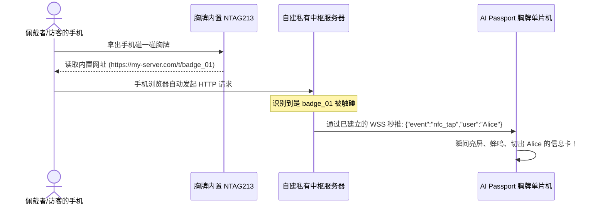

<p align="right">
  <a href="architecture.md">English</a> · <strong>简体中文</strong>
</p>

# 端云协同超级瘦终端架构与服务端 BFF 蓝图

> **官方仓库未涉足的“另一半天空”**：官方仓库的所有文档均聚焦于脱机独立固件、硬件能力验证菜单与单一离线 Demo。本文档专门针对拥有**自建私有服务器或本地高性能电脑**的开发者，系统性定义了**端云协同超级瘦终端体系**——在严格遵守 ESP32-C3 内存底线的前提下，彻底打破硬件物理枷锁。
>
> *(注：关于板级硬件引脚、寄存器时序及电气参数等既有事实，请直接参考官方权威源头：`components/bsp/include/bsp_pins.h` 与 `docs/hardware-design/AI_HARDWARE_DEVELOPMENT_GUIDE.md`。)*

---

## 1. 核心范式：物理实体信物（Persona）+ 云端超级大脑（Brain）

官方仓库将 AI Passport 视为单一的 MCU 嵌入式设备。而在引入私有服务端后，整个系统层级发生了根本性倒置：

```text
┌──────────────────────────────────────────────┐
│     FoloToy AI Passport (物理实体信物)       │
│                                              │
│  • 输入感知: PTT 16kHz PCM 麦克风音频推流    │
│  • 视觉呈现: 240×320 焦点光标 HUD 界面与     │
│              30fps 1-bit 辐射复古极简动画    │
│  • 声音表达: ES8311 MP3 分块流式解码发声     │
│  • 物理锚点: 被动 NTAG213 标签供手机碰一碰   │
└──────────────────────┬───────────────────────┘
                       │
          单条全双工 WSS (TLS WebSocket) 隧道
          (复用二进制音频帧 + 极简 JSON 控制帧)
                       │
┌──────────────────────▼───────────────────────┐
│       私有中枢服务器 / 本地电脑 (超级大脑)   │
│                                              │
│  • BFF 网关: 强力数据裁剪 (输出 < 512B JSON) │
│  • 语音处理: 本地 Whisper STT + 流式 TTS 合成│
│  • 智能中枢: Claude / GPT-4o / 本地 Ollama   │
│  • 自动化执行: 联动 IDE、Git Hooks、自动化   │
│  • 视觉转码: 将视频/GIF 转为 1-bit RLE 点阵  │
└──────────────────────────────────────────────┘
```

---

## 2. 存储与内存分工：三级金字塔模型

为确保在**没有 PSRAM**、仅有约 100 KB 可用堆的 ESP32-C3 上绝对不发生内存碎片与 OOM 崩溃：

```text
  ┌─────────────────────────────────────────────────────────────────────────────┐
  │ 1. 设备端 RAM (约 100 KB 空闲堆) ──► 极小瞬态滑动视口缓冲区                 │
  │    • PTT 麦克风采集: 2 KB 乒乓双缓冲 (1024 字节 × 2)                        │
  │    • TTS 音频播放: 16 KB 环形缓冲区 (接收 MP3 分块切片)                     │
  │    • 屏幕文本 Label 显存: < 1 KB (仅容纳当前视口约 200 个汉字)              │
  │    • LVGL 绘图缓冲: 9.6 KB (官方单行 20 行 DMA 显存)                        │
  ├─────────────────────────────────────────────────────────────────────────────┤
  │ 2. 设备端 Flash (8 MB NOR Flash) ──► 本地军火库与离线阅读缓存               │
  │    • 嵌入式字库 (Montserrat 英文 + 常用精简中文字符轮廓)                    │
  │    • 常用固定高频音效 (按键音、报警蜂鸣、开机旋律、风铃提示)                │
  │    • 离线阅读缓存 (通过 LittleFS 文件系统追加写入长文对话，断网可翻阅)      │
  │    • 调色板查表库 (LUT: 预置辐射绿、军工琥珀、黑客帝国绿等色值)             │
  ├─────────────────────────────────────────────────────────────────────────────┤
  │ 3. 服务端存储 (无限容量)         ──► 终极数据库与永久真理之源 (Truth)       │
  │    • 永久归档高保真原声录音 (WAV/FLAC)                                      │
  │    • 完整多轮对话树、代码历史与知识库向量图谱 (RAG)                         │
  │    • 复杂的业务逻辑、外部工具调用中间件与机密 Token                         │
  └─────────────────────────────────────────────────────────────────────────────┘
```

> **绝对避坑铁律**：**切勿将 32 KB/s 的实时录音写入 NOR Flash**。Flash 擦除 4KB 扇区会锁死 SPI 总线导致音频破音，且擦写寿命有限。实时录音必须直接：`I2S DMA (2KB RAM) ──► TCP Socket 直通云端`。

---

## 3. 强制单连接全双工 WebSocket 铁律（与 REST 的致命缺陷对比）

在嵌入式 AI 设备的通信选型中，直觉上常常认为“REST API 每次请求完就释放连接，是否更省资源？”。**对于 ESP32-C3（无 PSRAM、堆内存 ~100 KB）上的实时语音与 AI 交互，REST 实际上是性能与内存的灾难**：

### 3.1 为什么语音交互严禁使用 REST API 短连接？
1. **音频无法在内存缓冲（No-PSRAM 物理限制）**：
   - 麦克风采集 16kHz 16-bit 单声道 PCM 码率为 32 KB/s，一段 5 秒的提问录音数据量达 **160 KB**。
   - ESP32-C3 可用堆内存仅约 100 KB，根本没有空间在 RAM 中存下整段音频去做 HTTP POST。
   - 严禁将录音写入 Flash 缓存（擦写 4KB 扇区会锁死 SPI 总线数十毫秒导致音频破音，且加速 NOR Flash 寿命报废）。必须通过流式（Streaming）边采边发（2 KB 双缓冲直通）。
2. **TLS 握手内存剧烈抖动与堆碎片（RAM Spike）**：
   - 每次发起 HTTPS REST 请求，ESP32 必须进行一次非对称 TLS 握手，**瞬时需动态申请 30 ~ 35 KB 堆内存**。
   - 在可用堆仅 100 KB 的环境下，频繁短连接极易引发堆内存碎片化，导致偶发性 `out of memory` 重启。
   - **WebSocket 只需在建连时握手一次**；进入稳定传输态后仅需保留对称加密和 TCP 上下文，**常驻内存仅约 12 ~ 16 KB**，内存曲线极其平稳。
3. **半双工排队与无法打断**：
   - REST 严格遵循“请求-响应”半双工模型，无法在播放 TTS 音频的同时接收 UI 状态同步，更无法在用户中途打断播报时及时向云端发送中断信号。

### 3.2 规范方案：单一 WSS 连接全双工多路复用

所有热路径流量统一走一条持久化 WSS (TLS WebSocket) 连接：

```text
  客户端 ───────[ 二进制帧: 0x01 + 1024B PCM 录音分块 ]───────► 服务端 (语音推流，2KB双缓冲)
  客户端 ───────[ 文本帧: {"action":"press","btn":"ok"} ]─────► 服务端 (按键/打断/翻页事件)
  服务端 ◄──────[ 文本帧: {"type":"card_word", ...} ]──────── 客户端 (卡片结构化排版数据)
  服务端 ◄──────[ 文本帧: {"delta":"你好，正在思考..."} ]────── 客户端 (流式打字机吐字)
  服务端 ◄──────[ 二进制帧: 0x02 + MP3 压缩音频切片 ]──────── 客户端 (喇叭流式发声，边收边播)
  服务端 ◄──────[ 二进制帧: 0x03 + 1-bit 点阵/位图切片 ]────── 客户端 (生僻字/笔顺/复古动画)
```

### 3.3 连接生命周期与低功耗策略（按需保活，超时休眠）
长连接并不意味着必须 24 小时死守 Wi-Fi 射频耗尽电池：
* **活跃会话期**：保持 WebSocket 连接复用，每 30 秒维持轻量心跳或以事件驱动，实现 0ms 建连开销的秒级语音问答。
* **空闲超时切断**：若用户连续 **30 ~ 60 秒无任何交互**，客户端主动优雅关闭 WebSocket 连接，将 Wi-Fi 芯片置入 **Modem-Sleep 或 Light-Sleep** 模式（电流降至几毫安），大幅延长续航。
* **瞬时唤醒复用**：用户按下按键时瞬间唤醒 Wi-Fi，利用 TLS 会话复用（Session Ticket）在 100~200ms 内快速恢复 WSS，兼顾极致省电与极速响应。

---

## 4. 虚拟视口机制（Virtual Viewport：无限长文分页浏览）

当服务端大模型生成一篇数万字的长篇回答时：

1. **生成时实时呈现**：服务端推流每个 Token，屏幕即时呈现打字机效果（前 200 字）。同时，设备将流式文本顺序追加写入本地 Flash 文件（`/spiffs/chat_last.txt`）。
2. **翻页与浏览**：
   - **本地离线模式（0ms 延迟）**：用户按 `DOWN` 键，设备从 Flash 文件直接拉取接下来 14 行文字并刷上屏幕；
   - **云端游标模式（无状态）**：若不写 Flash，按 `DOWN` 发送 `{"req":"page","offset":1}`，服务端切出下个 200 字段（<500 字节）下发覆盖。
3. **内存恒定**：无论文章多长，设备上负责文本显示的 LVGL Label **永远只消耗不到 1 KB 内存**！

---

## 5. 服务端视频转码与调色板动画引擎（辐射绿 / 琥珀 CRT）

ESP32-C3 软解全彩 H.264 视频不可行，但通过**“服务端点阵压缩 + 终端调色板查表（LUT）”**，依然能满血跑出 **25~30 帧的极客复古流式动画**：

### 渲染管道架构
```text
  [服务端: 任意视频或 GIF 源]
         │
         ▼ (FFmpeg 缩放到 240×320 + 动态阈值二值化 + 游程压缩 RLE)
  [2 ~ 3 KB RLE 极小压缩帧]
         │
         ▼ (通过 WebSocket 极速推流)
  [AI Passport 终端: 通过调色板查表映射为 RGB565]
         │
         ├── 数值 0 ──► 背景色: CRT 荧光暗底黑 (#061006)
         └── 数值 1 ──► 前景色: 辐射 Pip-Boy 经典高光绿 (#20FF20)
         │
         ▼ (奇偶行微调亮度: 零成本 CRT 扫描线光栅滤镜)
  [ST7789P3 屏幕]: 呈现出极其惊艳、丝滑流畅的《辐射》终端动画！
```

### 极客调色板代码定义
```c
// 设备端调色板预设数组
static const uint16_t PALETTE_FALLOUT[2]  = { 0x0841, 0x27E4 }; // #061006 (深墨绿), #20FF20 (辐射高亮绿)
static const uint16_t PALETTE_AMBER[2]    = { 0x1040, 0xFD60 }; // #100800 (深棕黑), #FFB000 (温暖琥珀橙)
static const uint16_t PALETTE_MATRIX[2]   = { 0x0100, 0x07E6 }; // #020A02 (极深黑), #00FF66 (冷翡翠绿)
```

---

## 6. 被动 NFC（NTAG213）的动态云端中继（Cloud Relay）

AI Passport 内置的 NTAG213 标签是无源被动贴片，**单片机没有线路连接这枚标签**。为了让胸牌在被手机碰触时产生“主动交互感”：



---

## 7. 接口协议标准与数据传输契约规范（Wire Protocol & API Contract）

无论服务端采用何种语言或框架实现，与 ESP32-C3 客户端交互时，必须严格遵循以下精简、低内存的传输契约。

### 7.1 辅助 REST API 契约（严格限定于离线/冷路径）

> [!WARNING]
> **红线警示**：REST API 仅允许用于设备初次上线、配网校验等低频无状态流程。**严禁**将 REST API 用于语音上传、实时问答、大模型 Token 吐字流或卡片状态同步。

#### 1. 状态看板拉取（BFF 脱水接口）
* **请求**：`GET /api/v1/hud?badge_id={id}`
* **约束**：单片机无 PSRAM，响应体 JSON 严格控制在 `< 512 字节`。
* **响应格式**：
  ```json
  {
    "title": "当前核心状态标题",
    "sub": "副标题/当前任务进度",
    "status_code": 1,
    "color": "rad_green",
    "options": ["操作A", "操作B"]
  }
  ```

#### 2. 无限长文本虚拟视口分页拉取（备用冷拉取通道）
* **请求**：`GET /api/v1/text/page?badge_id={id}&doc_id={id}&offset={n}&limit=200`
* **约束**：240×320 屏幕一屏约容纳 150~200 个字，单次只取一屏（推荐优先在 WSS 文本帧中发送 `{"req":"page"}` 获取）。
* **响应格式**：
  ```json
  {
    "doc_id": "conv_9821",
    "offset": 2,
    "total_pages": 12,
    "has_next": true,
    "text": "这是当前视口切片的 200 个字符内容..."
  }
  ```

#### 3. 被动 NFC 碰一碰反向触发接口
* **请求**：`GET /t/{badge_id}`
* **场景**：手机贴近 NTAG213 标签时，手机浏览器自动访问此 URL。
* **行为**：服务端接收到该请求后，异步向当前在线的该胸牌 WebSocket 发送推送事件，同时向手机浏览器返回移动端网页。

---

## 7.2 核心 WebSocket 全双工多路复用契约（`/ws/badge/{badge_id}`，强制交互标准）

所有高实时、流式交互复用这单一 WebSocket 管道，通过**区分文本帧与二进制帧**来切分数据流：

#### 1. 上行数据（客户端 ──► 服务端）
| 帧类型 | 内容与格式 | 传输规格与时序 |
| :--- | :--- | :--- |
| **二进制帧** | 麦克风录音 PCM 数据流 | 16 kHz、16-bit、单声道 raw PCM。每采集 1024 字节（32ms）发送一包。 |
| **文本帧** | 物理按键与状态事件 | JSON 格式：`{"type":"btn","key":"ok","gesture":"short"}` |

#### 2. 下行数据（服务端 ──► 客户端）
| 帧类型 | 内容与格式 | 客户端处理行为 |
| :--- | :--- | :--- |
| **文本帧 (文字流)** | 实时打字机 Token：<br>`{"type":"delta","text":"字"}` | 追加到当前屏幕 Label，内存恒定仅需局部 Buffer。 |
| **文本帧 (卡片结构体)** | 结构化教育卡片：<br>`{"type":"card_word", "word":"apple", ...}`<br>`{"type":"card_char", "char":"舞", "pinyin":"wǔ", ...}` | 解析后更新 LVGL 卡片布局控件，直接呈现教学信息。 |
| **二进制帧 (音频流)** | MP3 音频切片流（首字节加魔数 `0x02`） | 写入 16KB 环形缓冲区，预充 4KB 后启动 I2S 解码播放。 |
| **二进制帧 (点阵/动画流)** | 1-bit / 2-bit RLE 压缩点阵（首字节魔数 `0x03`） | 针对生僻字/笔顺拆解/复古动效，端侧直接解压到显存绘制，避开本地字库限制。 |
| **文本帧 (控制指令)** | 强制换屏/警报指令：<br>`{"type":"alert","level":"critical","msg":"报警"}` | 触发蜂鸣器并切换 UI 界面为警告 HUD。 |

---

### 7.3 音频、文本与画面的传输参数推荐标准

| 数据流向 | 传输通道 | 格式与编码 | 单包/缓冲大小 | 延迟与性能目标 |
| :--- | :--- | :--- | :--- | :--- |
| **麦克风语音上行** | WSS 二进制帧 | 16kHz 16-bit 单声道 PCM | 1024 字节 / 包 (32ms/包) | 端侧仅占 2KB 双缓冲；云端流式 VAD 识别 |
| **扬声器语音下行** | WSS 二进制帧 | 32~64kbps CBR/VBR MP3 | 切片流 (每块 512~2048 字节) | 端侧 16KB 环形缓冲，预充 4KB 启动防破音 |
| **打字机/卡片下行** | WSS 文本帧 | UTF-8 JSON 增量/结构化卡片 | 几十字节 ~ 几百字节 / 包 | 首字延迟 (TTFT) < 300ms，屏幕流式呈现 |
| **点阵位图/动画下行**| WSS 二进制帧 | 1-bit / 2-bit RLE 压缩点阵 | 512 字节 ~ 3 KB / 帧 | 生僻字秒级上屏，动画 25~30 fps 满血流畅 |
